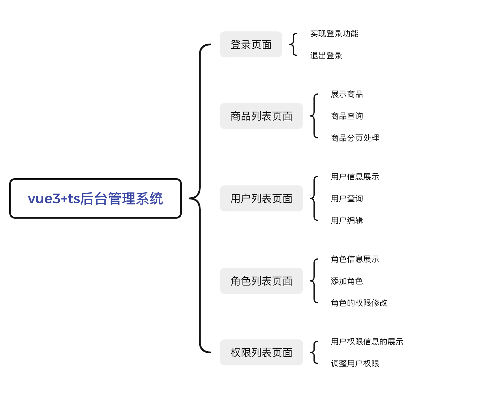

# timeback 前端

## user(用户页面)

—— 是用户的页面

1. 代码和 vue3-ts-demo 完全一样
2. 需要自己修改,有些内容不对 user 开放,比如 post 的审批.
### 代码地址:
https://github.com/zflbigbang/user

## vue3-ts-demo(管理员页面)
### 代码地址:
https://github.com/zflbigbang/vue3-ts-demo
### 这是一个 demo 没有进行改动

### b 站手把手视频教程:

https://www.bilibili.com/video/BV1nr4y1G73d/?spm_id_from=333.337.search-card.all.click&vd_source=dfb8bfac992fb1bf9f1788cb0cd410d3

### 接口文档:

baseURL：https://www.fastmock.site/mock/bf1fcb3c2e2945669c2c8d0ecb8009b8/api

登录接口
地址：/login
方式：post
参数：username && password

商品列表接口
地址：/getGoodsList
方式：get

用户列表接口
地址：/getUserList
方式：get

角色列表接口
地址：/getRoleList
方式：get

权限列表接口
地址：/getAuthorityList
方式：get

### 结构图
